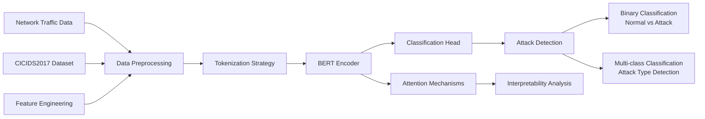
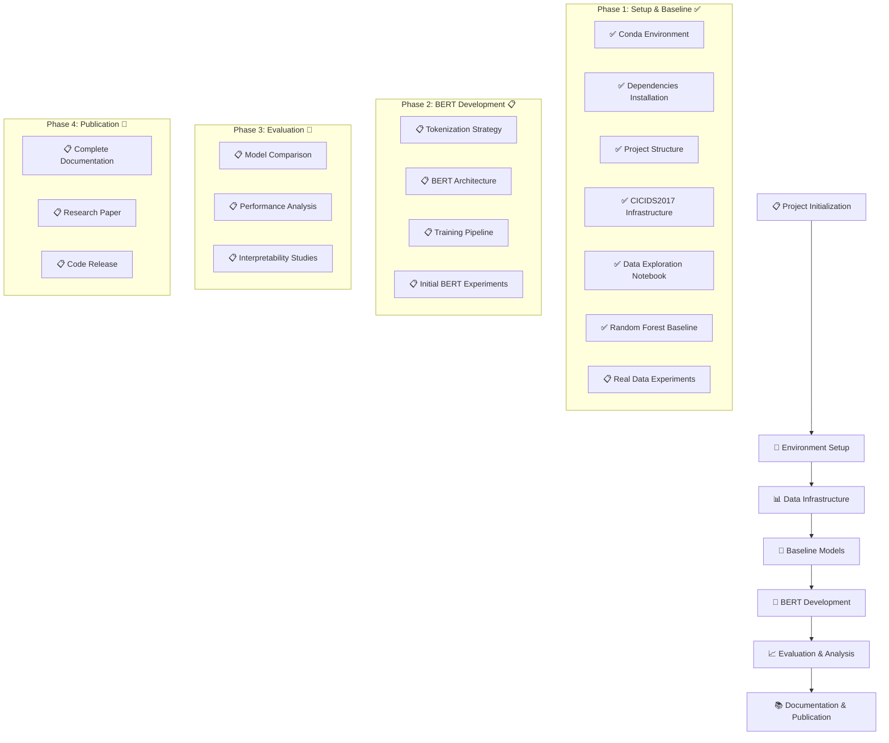

# BERT-IDS: Network Intrusion Detection Using BERT

[](https://opensource.org/licenses/MIT)
[](https://www.python.org/downloads/)
[](https://pytorch.org/)

> **⚠️ Status Proyek**: Dalam tahap pengembangan awal. Penelitian ini masih dalam fase setup dan baseline development.

## 📋 Deskripsi Proyek

**BERT-IDS** adalah penelitian yang bertujuan menerapkan arsitektur Bidirectional Encoder Representations from Transformers (BERT) untuk deteksi intrusi jaringan. Proyek ini masih dalam tahap awal pengembangan dengan fokus pada setup infrastruktur dan implementasi baseline.


### 🎯 Tujuan Penelitian

- Mengembangkan framework untuk menerapkan BERT pada deteksi intrusi jaringan
- Membandingkan performa BERT dengan metode tradisional
- Menganalisis kemampuan BERT dalam mendeteksi berbagai jenis serangan
- Menyediakan interpretabilitas model melalui attention mechanisms

## 🔬 Metodologi Penelitian (Planned)

### Dataset yang Akan Digunakan
- **CICIDS2017**: Dataset utama untuk eksperimen (setup completed)
- **Baseline Models**: Random Forest (implemented)

### Arsitektur Model (Planned)



**Pipeline Flow:**
```
Network Traffic → Tokenization → BERT Encoder → Classification Head → Attack Detection
```

### Baseline Comparisons (Planned)
- Traditional ML: Random Forest (✅ implemented), SVM, Naive Bayes
- Deep Learning: CNN, LSTM, GRU
- Transformer Variants: BERT, DistilBERT

## 🚀 Quick Start

### Prerequisites
- Python 3.8+
- CUDA-capable GPU (recommended for future BERT training)
- 16GB+ RAM

### Installation

1. **Clone repository** (Repository belum dibuat)
```bash
# Repository akan tersedia di:
# git clone https://github.com/username/bert-ids.git
# cd bert-ids
```

2. **Create Conda environment** (✅ Completed)
```bash
# Environment sudah dibuat dengan nama 'bert-ids'
conda env create -f environment.yml
conda activate bert-ids
```

3. **Install dependencies** (✅ Completed)
```bash
# Dependencies sudah terinstall dalam environment
# Lihat environment.yml dan requirements.txt untuk detail
```

### Dataset Setup (⚠️ Manual Download Required)

1. **Download CICIDS2017 dataset**
   - Kunjungi: https://www.unb.ca/cic/datasets/ids-2017.html
   - Download dataset files
   - Extract ke direktori: `data/raw/cicids2017/`

2. **Struktur direktori sudah siap** (✅ Completed)
```bash
# Direktori sudah dibuat otomatis
data/raw/cicids2017/README.md  # Berisi instruksi download
```

### Current Available Features

```bash
# Explore data (dengan synthetic data untuk testing)
jupyter notebook notebooks/01_data_exploration.ipynb

# Run Random Forest baseline
jupyter notebook notebooks/02_baseline_random_forest.ipynb
```

## 📊 Status Eksperimen

### ✅ Completed Work

#### 1. Project Setup
- ✅ Conda environment dengan semua dependencies
- ✅ Struktur proyek yang terorganisir
- ✅ Git repository setup (local)

#### 2. Data Infrastructure
- ✅ Dataset download script dan instruksi
- ✅ Data exploration notebook (dengan synthetic data fallback)
- ✅ Data preprocessing pipeline

#### 3. Baseline Implementation
- ✅ Random Forest baseline model
- ✅ Comprehensive evaluation framework
- ✅ Feature importance analysis
- ✅ Cross-validation setup

### ⏳ Pending Work

#### Immediate Next Steps
- 📋 Download actual CICIDS2017 dataset
- 📋 Run baseline experiments dengan real data
- 📋 Create GitHub repository
- 📋 Validate data preprocessing pipeline

#### Future Development
- 📋 BERT tokenization strategy design
- 📋 BERT model architecture implementation
- 📋 Training pipeline development
- 📋 Comparative analysis framework

### 📈 Current Capabilities

**What's Working Now:**
- Complete development environment
- Data exploration with synthetic data
- Random Forest baseline (ready for real data)
- Evaluation metrics and visualization
- Model persistence and results tracking

**What Needs Real Data:**
- Actual performance metrics
- Feature importance on real network traffic
- Class imbalance analysis
- Attack type distribution analysis

## 📁 Struktur Proyek (Current)

```
BERT-IDS/
├── README.md                 # Project documentation
├── prd.md                   # Research Proposal Document
├── requirements.txt         # Python dependencies
├── environment.yml          # Conda environment specification
├── .gitignore              # Git ignore rules
├── configs/                # Configuration files (to be created)
├── src/                    # Source code packages
│   ├── __init__.py         # ✅ Created
│   ├── data/               # Data processing modules
│   │   └── __init__.py     # ✅ Created
│   ├── models/             # Model architectures
│   │   └── __init__.py     # ✅ Created
│   ├── training/           # Training utilities
│   │   └── __init__.py     # ✅ Created
│   └── utils/              # Utility functions
│       └── __init__.py     # ✅ Created
├── scripts/                # Utility scripts
│   └── download_datasets.py # ✅ Dataset download utility
├── notebooks/              # Jupyter notebooks
│   ├── 01_data_exploration.ipynb      # ✅ Data exploration
│   └── 02_baseline_random_forest.ipynb # ✅ Random Forest baseline
├── tests/                  # Unit tests (to be implemented)
├── data/                   # Data directory
│   ├── raw/                # Raw datasets
│   │   └── cicids2017/     # ✅ Directory structure ready
│   ├── processed/          # Processed datasets
│   └── external/           # External datasets
├── models/                 # Saved models
│   └── checkpoints/        # Model checkpoints
├── results/                # Experiment results
│   ├── logs/               # Training logs
│   ├── figures/            # Generated plots
│   └── reports/            # Analysis reports
└── docs/                   # Documentation
    └── project_progress.md # ✅ Comprehensive progress documentation
```

### 📋 File Status Legend
- ✅ **Created and Ready**: File/directory exists and functional
- 📁 **Directory Ready**: Structure created, awaiting content
- 📋 **Planned**: To be implemented in future phases
## 🔧 Development Environment

### Current Setup (✅ Completed)
- **Python**: 3.8
- **Environment Manager**: Conda (`bert-ids` environment)
- **Main Libraries**: 
  - PyTorch 1.12+
  - scikit-learn
  - transformers (Hugging Face)
  - pandas, numpy
  - matplotlib, seaborn, plotly
  - jupyter

### Environment Activation
```bash
conda activate bert-ids
jupyter notebook  # To run notebooks
```

## 🧪 Current Experiments

### Available Notebooks

#### 1. Data Exploration (`01_data_exploration.ipynb`)
**Status**: ✅ Ready to run
- Comprehensive data loading and analysis
- Feature distribution analysis
- Class imbalance investigation
- Data quality assessment
- Synthetic data generation for testing

#### 2. Random Forest Baseline (`02_baseline_random_forest.ipynb`)
**Status**: ✅ Ready to run
- Complete preprocessing pipeline
- Random Forest model training
- Cross-validation setup
- Feature importance analysis
- Model evaluation metrics
- Results visualization

### Running Experiments
```bash
# Activate environment
conda activate bert-ids

# Start Jupyter
jupyter notebook

# Open and run notebooks:
# - notebooks/01_data_exploration.ipynb
# - notebooks/02_baseline_random_forest.ipynb
```

## 📚 Documentation

### Available Documentation
- **[Project Progress](docs/project_progress.md)** - ✅ Comprehensive progress tracking
- **[Research Proposal](prd.md)** - ✅ Complete research proposal document
- **[Dataset Instructions](data/raw/cicids2017/README.md)** - ✅ CICIDS2017 download guide

### Planned Documentation
- API Documentation (when BERT implementation starts)
- Dataset Processing Guide (after real data experiments)
- Model Architecture Guide (future BERT implementation)
- Experiment Results (after running experiments with real data)

## 🤝 Contributing

Proyek ini masih dalam tahap pengembangan awal. Kontribusi akan dibuka setelah:
- ✅ GitHub repository setup
- ✅ Initial experiments dengan real data
- ✅ BERT implementation baseline

## 📄 License

Proyek ini akan dilisensikan under MIT License.

## 📞 Contact

- **Peneliti**: [Nama akan diisi]
- **Email**: [Email akan diisi]
- **Institusi**: [Institusi akan diisi]

## 🙏 Acknowledgments

- Hugging Face untuk library Transformers
- PyTorch team untuk framework deep learning
- Canadian Institute for Cybersecurity untuk CICIDS2017 dataset
- [Supervisor/Advisor names akan diisi]

## 📖 Citation

*Citation akan tersedia setelah publikasi*

```bibtex
@misc{bertids2025,
  title={BERT-IDS: Network Intrusion Detection Using BERT},
  author={[Author names akan diisi]},
  year={2025},
  note={Work in Progress}
}
```

## 🔄 Project Roadmap



### Phase 1: Setup & Baseline (✅ Current)
- ✅ Environment setup
- ✅ Data infrastructure
- ✅ Random Forest baseline
- ✅ GitHub repository
- 📋 Real data experiments

### Phase 2: BERT Development (Planned)
- 📋 Tokenization strategy design
- 📋 BERT architecture implementation
- 📋 Training pipeline development
- 📋 Initial BERT experiments

### Phase 3: Evaluation & Analysis (Future)
- 📋 Comprehensive model comparison
- 📋 Performance analysis
- 📋 Interpretability studies
- 📋 Scalability testing

### Phase 4: Documentation & Publication (Future)
- 📋 Complete documentation
- 📋 Research paper preparation
- 📋 Code release and maintenance

---

**Status Penelitian**: 🚧 Phase 1 - Setup & Baseline Development

**Last Updated**: January 2025

**Next Milestone**: Complete real data experiments and GitHub repository setup


